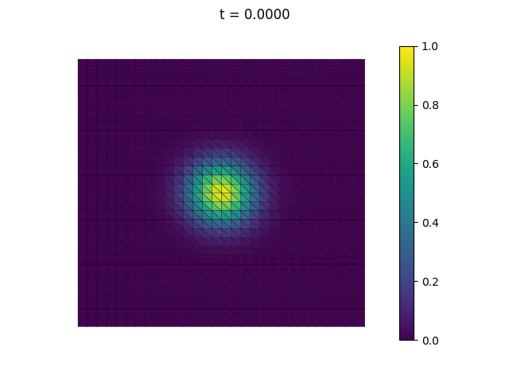

Translation into scikit-fem from FEniCS of
[ft04_heat_gaussian.py](https://fenicsproject.org/pub/tutorial/python/vol1/ft04_heat_gaussian.py)
as discussed in [‘The heat
equation/Test problem 2: diffusion of a gaussian function’](https://fenicsproject.org/pub/tutorial/html/._ftut1006.html#___sec51).

This is very similar to (03_heat)[../03_heat].

