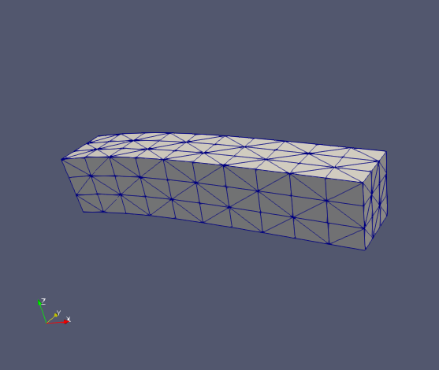

Translation into scikit-fem from FEniCS of
[ft06_elasticity.py](https://fenicsproject.org/pub/tutorial/python/vol1/ft06_elasticity.py) as discussed in [‘The equations of linear elasticity’](https://fenicsproject.org/pub/tutorial/html/._ftut1008.html#ftut:elast).

Much like
[ex11](https://github.com/kinnala/scikit-fem/blob/master/docs/examples/ex11.py)?
That has MeshHex and ElementHex1, and uses skfem.models.elasticity, or
[ex21](https://github.com/kinnala/scikit-fem/blob/master/docs/examples/ex21.py)
which has MeshTet and ElementTetP1.  Except that this one is subject
to gravity rather than a displacement imposed at the boundary (ex11);
ex21 is an eigenproblem.

_Figure:—_ Deformed beam
