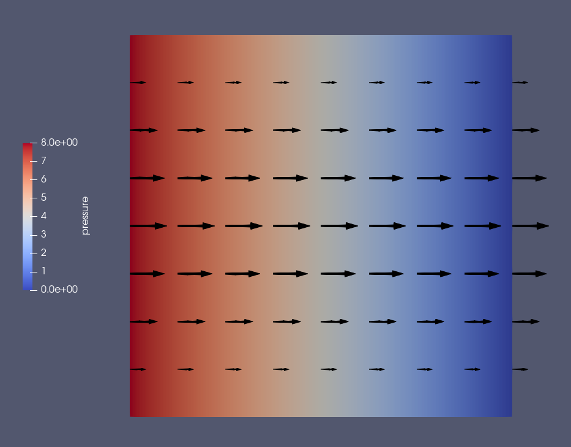

Translation into scikit-fem from FEniCS of
[ft07_navier_stokes_channel.py](https://fenicsproject.org/pub/tutorial/python/vol1/ft07_navier_stokes_channel.py) as discussed in [‘The Navier–Stokes equations ’](https://fenicsproject.org/pub/tutorial/html/._ftut1009.html#ftut1:NS).

# A first-order pressure-correction algorithm

The IPCS (Incremental Pressure Correction Scheme) is not adopted exactly but rather simplified as far as possible; in particular:

* The advective terms are dropped (they vanish identically in unsteady plane Poiseuille flow).

* The stress-divergence is dropped in favour of the velocity-Laplacian formulation of the viscous term.

* Trapezoidal rule for viscous term is dropped in favour of backward Euler.

The three steps are:

# u~ / dt - lap u~ = u~_ / dt - grad (2p_ - p__)

# lap (dp) = div u~ / dt, p += dp

# du / dt = grad (p - p_), u = u~ + du

Then reset with u~_ = u~, p__ = p_, p_ = p.

# Results

_Figure:—_ Velocity vectors and pressure field at νt/h² = 1.
